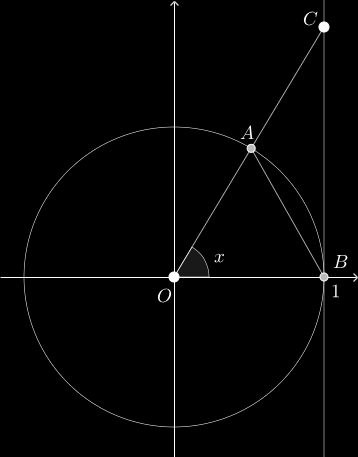

## Первый замечательный предел

> [!important] Теорема
>
> $$
> \lim_{x\to0}\frac{\sin x}{x}=1.
> $$

### Геометрическая оценка

Пусть $0<x<\pi/2$. Рассмотрим единичную окружность, угол $x$ в радианах, точки $O,A,B$ и касательную $BC$, как на рисунке из презентации.

Из вложения фигур следует

$$
S_{\triangle OAB}<S_{\text{сектор }OAB}<S_{\triangle OCB}.
$$

Их площади равны соответственно $\frac12\sin x$, $\frac x2$ и $\frac12\tan x$. Поэтому

$$
\sin x<x<\tan x.
$$

Учитывая нечётность синуса и $|\sin x|\le1$, получаем также

$$
|\sin x|\le|x|\qquad\forall x\in\mathbb R.
$$

### Переход к пределу

Разделив оценку на $\sin x$ и используя чётность полученных функций, имеем

$$
1<\frac{x}{\sin x}<\frac1{\cos x},\qquad
0<|x|<\frac\pi2.
$$

Покажем, что $\cos x\to1$. Из полученной оценки синуса

$$
|\cos x-1|=2\sin^2\frac x2
\le2\left|\sin\frac x2\right|
\le|x|.
$$

Для $\varepsilon>0$ достаточно взять $\delta=\varepsilon$. Тогда $|x|<\delta$ влечёт $|\cos x-1|<\varepsilon$.

По теореме о сжатой переменной $x/\sin x\to1$. Переход к обратной величине завершает доказательство.

## Источник

[«Шпора», слайды 59–60](_slides.pdf#page=59).
